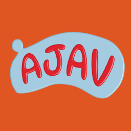

# Ajav (ALPHA)

Ajav is friv alternative with C/Raylib

## Games

### WeakPompaelo

Based in Poplona

## Build and compilation

Dependecies:

```
BUILD: raylib 5.5+ PLATFORM_WEB
LOCATION: MAIN_FOLDER

BUILD: emsdk 4.0.23
LOCATION: MAIN_FOLDER
```

Run compile.sh to compile the main menu
Run ../game_compile.sh in game folder to compile the game


